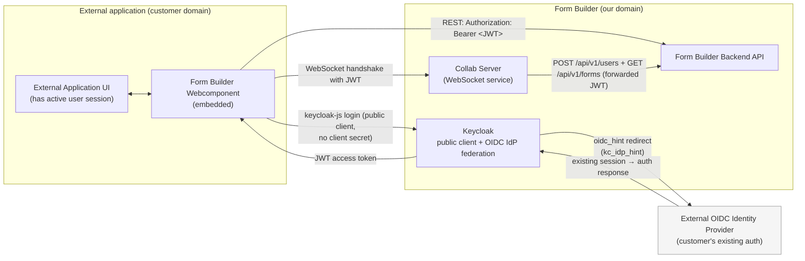
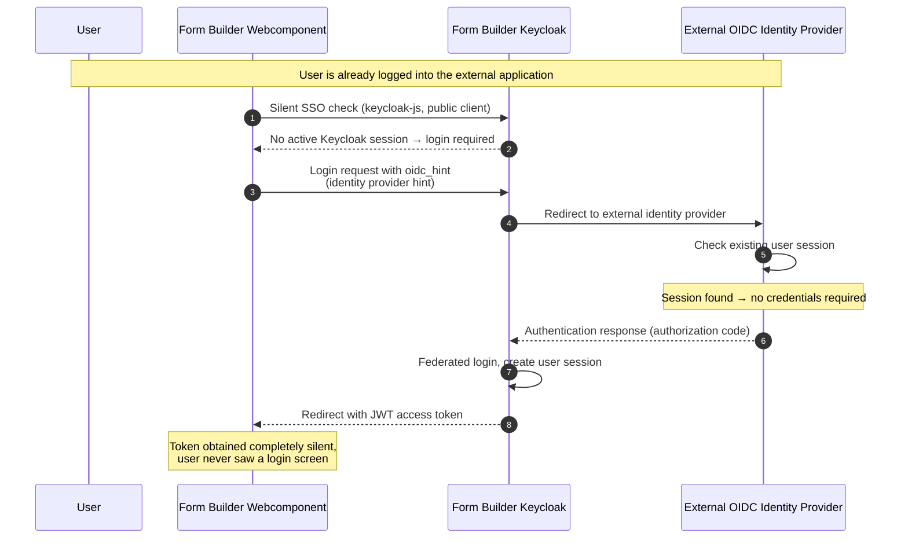
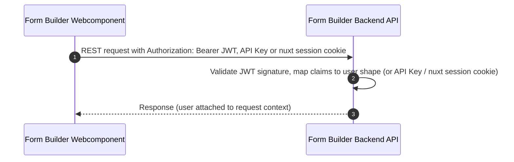
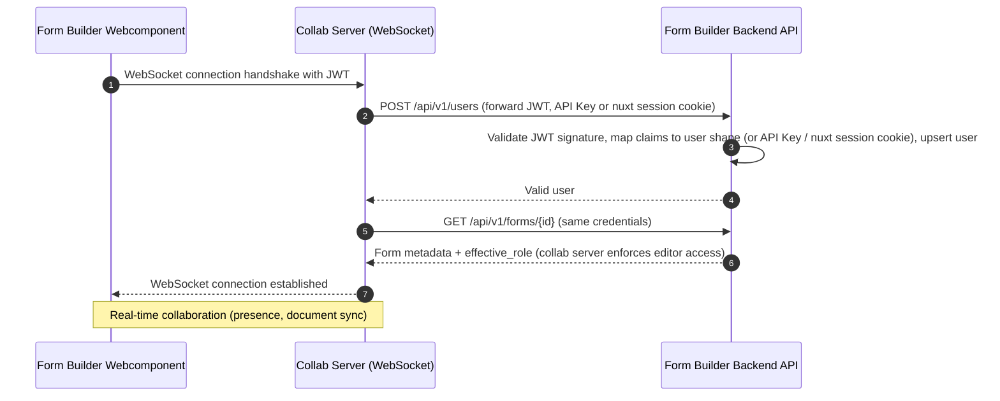

# Authentication

The application supports three ways to authenticate a request. The global auth middleware (`server/middleware/auth.ts`) resolves them in this order and attaches the user to `event.context.user`; protected oRPC procedures throw `UNAUTHORIZED` when no user was resolved. The same middleware also protects the routes the collab server (separate process) calls to validate WebSocket handshakes: `POST /api/v1/users` (authenticates and upserts the user) and `GET /api/v1/forms/{id}` (checks form existence and access, returns the caller's `effective_role`, which the collab server uses to enforce editor access).

## 1. Session cookie (OIDC login)

Handled by the [nuxt-auth](https://github.com/nuxt-community/auth-module) module. On success a nuxt-auth-utils session is created and the browser gets the `nuxt-session` cookie. Requests carrying the cookie resolve the session via `getUserSession()`. See [server/routes/auth/keycloak.get.ts](server/routes/auth/keycloak.get.ts) for implementation details.

## 2. API keys (`fb_...`)

Static keys created in the app's API-key management. Sent as `Authorization: Bearer fb_...`; validated against the database by `ApiKeyService` (SHA-256 hash). Can be used for other services or scripts to access the API without a user session. See [server/services/ApiKeyService.ts](server/services/ApiKeyService.ts) for implementation details.

## 3. Keycloak access tokens (JWT)

The webcomponent embedded on **other domains** cannot rely on the session cookie. Instead keycloak-js is used to authenticate against a public keycloak client. The collab server forwards it for the websocket handshake exactly like an API key. `server/lib/jwt-auth.ts` validates signature (realm JWKS, cached), `iss`, `aud` and `exp` with `jose` and maps the claims to the same user shape as the session user. See [server/lib/jwt-auth.ts](server/lib/jwt-auth.ts) for implementation details in the backend as well as [composables/useBuilderAuth.ts](../../packages/vue-json-form-builder/src/composables/useBuilderAuth.ts) for the frontend authentication code using keycloak-js.

The frontend also supports silent SSO (Single Sign-On) using keycloak-js. In combination with an authentication federation with the OIDC client the integrating app already uses and an `oidc_hint` that Keycloak supports, this leads to a silent login process for the user since they are automatically authenticated if they have an active session with the identity provider. An example application exists in [apps/json-forms-builder-example](../../apps/json-forms-builder-example) that demonstrates this behavior and explains more details.

### Auth Integration with external oidc provider

The Form Builder Frontend Webcomponent can be integrated within other applications and still needs to communicate with the form builder backend and the Websocket Service. When the customer already uses an OIDC compatible authentication system, a integration within the existing form builder authentication is possible. First of all, we need to use `JWT authentication`. The session cookie (1) is managed by nuxt and therefore not useable within the webcomponent. The api key (2) could be used but users form the external service would first need to be created and api keys would need to be managed by the external backend integrating the web component. The easiest way is using `JWT` tokens which are provided by a client within the keycloak of our application. In comparison to the client form the nuxt application, which is a private client with a client secret, the webcomponent depends on a public client since a cleint secret cant be stored securely within the webcomponent.

The next step is to link the oidc from the external application using the webcomponent and the keycloak of the form builder backend. Keycloak allows login through other OIDC compatible identity providers. The external application needs to be configured as an identity provider within the keycloak of the form builder backend. This makes it possible for users of the external application to login within the form builder backend and receive a JWT token which can be used for authentication within the webcomponent. Both backends don't need to do any extra work for user management. When leaving the authentication process like this, a user would need to manually login and click on the external provider within keycloak login but luckily we can make the process much more seamless for the user. Keycloak provides a feature called `identity provider hint` which can be used to automatically redirect the user to the external identity provider. The webcomponent can be configured to use this feature by providing the `oidc_hint` parameter (see [docs](https://www.keycloak.org/docs/latest/server_admin/index.html#_client_suggested_idp)) within the login request. When the user is logged into the external application, he already has a valid session so no additional input by the user is required and the user is automatically logged in. Keycloak additionally provides a `silent SSO` (see [here](https://www.keycloak.org/securing-apps/javascript-adapter#_using_the_adapter)) feature which can be used to automatically get the JWT token without any user interaction. This makes it possible to get a token for the webcomponent completely silent without any user interaction at all.

#### Overview of the authentication flow

#### Silent SSO login sequence (no user interaction required)

A demo application exists within [apps/json-forms-builder-example](../../apps/json-forms-builder-example) which goes into more detail on what needs to be configured and how the integration works. This uses a separate nuxt application and two local keycloak instances to showcase how they work together in a simple local demo application.

## General authentication flow

#### Rest API call with JWT token

Independent of the authentication method, the backend always resolves a user and attaches it to the request context. The Websocket service forwards the authentication information to the backend for validation. The following sequence diagram shows how a REST API call with a JWT token is handled and how the user is attached to the request context.

#### Rest API call with JWT token sequence (user attached to request context)

# Permissions

A Role based access control (RBAC) system is implemented in the backend. In the code the business logic for defining the roles and the classes containing all relevant permissions and capabilities of a role are defined [here](apps/json-forms-builder/server/lib/permissions). They are also reused in the frontend in order to show specific actions only to specific users. The backend validates these rule son api calls and the frontend only uses this logic for displaying the correct actions to the user. The backend is the single source of truth for permissions and capabilities.

# Security

All api endpoints are secured by the same auth middleware. There exists one public api endpoint which doesn't require authentication (/status). Since no public endpoints (except the simple status endpoint) exist, this strongly reduces the risk of unauthenticated users being able to access data. The ways to authenticate were described above and are implemented within [the auth middleware](apps/json-forms-builder/server/middleware/auth.ts), The auth code also include logic from the [jwt validation](apps/json-forms-builder/server/lib/jwt-auth.ts) and the [Api Key Service](apps/json-forms-builder/server/services/ApiKeyService.ts) and also less critical code like the [user mapper functions](apps/json-forms-builder/server/lib/auth.ts). This code is critical as it is the guard for all actions to read and modify data.

A security test [auth-required](apps/json-forms-builder/tests/integration/tests/permissions/auth-required.integration.test.ts) exists which tests that all endpoints are protected and require authentication if not explicitly excluded within the test suite. This mitigates the risk of accidentally exposing endpoints to unauthenticated users. Test which validate an valid and invalid api key, session key and jwt.

In order to securely sync the current keycloak roles and set properties for users to the backend, a nuxt middleware [session](apps/json-forms-builder/server/plugins/session.ts) exists which runs on every new session and validates on the server side that the user is available in the database and if roles in keycloak changed, are reflected here properly.

The standalone vue form builder Vue and Webcomponent talk with the HocusPocus collaboration server over a websocket connection. The collab server is a separate process and is secured in the same way as the backend. The components have to either set a session token, a jwt or an api key and the collab server forwards this to the backend for validation. It first creates the user with the POST /users endpoint so we are sure the correct user information of the token is reflected in the backend and then calls the forms endpoint to validate the effective user role for this resource. This ensures that only users with the correct role can edit a form and the logic for calculation the roles is one done centrally in the backend.

Role based access control (RBAC) is also implemented in the backend at a central place within [permissions](apps/json-forms-builder/server/lib/permissions). This is reused in the frontend so only actions a user can do are displayed in the frontend but these rules are always validated on every request on the server side.

The RBAC system involves quite a bit of code as permissions can be inherited and overridden but only by more specific roles. Only specific users with specific roles can do certain actions. Admins can always do all actions. Additionally visible resources exist where users don't need explicit permission to have read-only access. In order to properly test the RBAC system, integration tests exist which extensively test these rules can be found within the [permissions tests directory](apps/json-forms-builder/tests/integration/tests/permissions).
