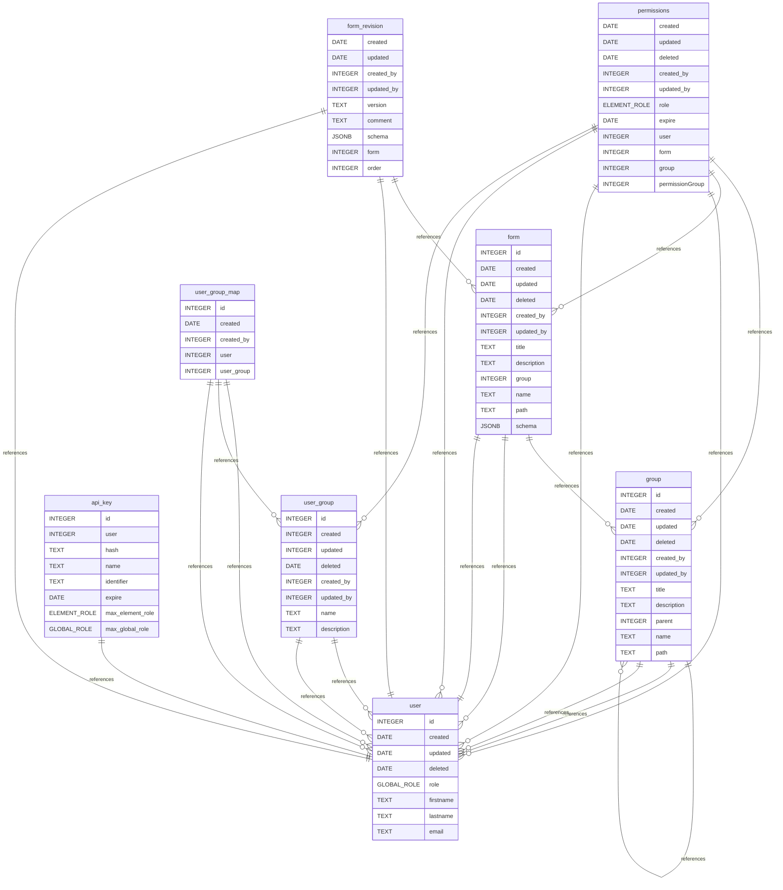

# Database

PostgreSQL is used as the database for the application. For development purposes a docker compose exists to start a database instance. [TypeORM](https://typeorm.io/) is used as the ORM to manage the database connection and schema. The database schema is automatically created by TypeORM when the backend service starts.

## Workflow: DrawDB and TypeORM

For visualization purposes and easier database design, the database is modeled using [DrawDB](https://github.com/drawdb-io/drawdb) and the db file [db.ddb](assets/db.ddb) can be opened with the tool to see a visual representation of the database. This database file is then manually converted to a TypeORM entity structure in the [server/db/entities](../server/db/entities/) folder. When starting the backend, TypeORM automatically creates the database schema based on the entity structure if it wasn't already created before. Migration of the database schema is also handled by TypeORM and has to be defined manually in the [server/db/migrations](../server/db/migrations/) folder.

## Database Structure

The database contains many basic structures, like `Users`, `UserGroups`, `Permissions`, `API-Keys` and specific for the Form builder `Forms` as well as `Grroups` where groups can be nested into each other allowing for a Tree structure creation.

### General

Most resources include a `deleted` property which is managed by TypeORM and is set when the resource is deleted. This allows for soft deletion of resources, meaning that they are not actually removed from the database but marked as deleted. This allows for easy restoration of resources if needed.

There also exists `created` and `updated` properties which are defined within `BaseTimestampedEntity` class and are set when a resource is created or updated. Lastly, some resources also store which user did actions on the resource by storing a `created_by` and `updated_by` property which is a foreign key to the `User` entity. This is defined within the `BaseAuditedEntity` class which extends the `BaseTimestampedEntity` class. Some resources cant be edited which leads to them only having a `created` and `created_by` property which is defined within the `BaseCreatedEntity` class.

### User

Users contain basic information like `name` and `email`. Since the app doesn't support authentication by its own but integrates using oidc, this information is provided by the oidc provider and stored in the database for permission features and general auditing purposes.

Users additionally feature a `role` which can be either `admin` or `user`. Admins have full access to all features of the application, including the ability to manage users for all `UserGroup`, creating `UserGroup` and also accessing all `Folder` and `Form` entities. Users on the other hand can only access `Folder` and `Form` entities they have been granted access to.

### User Group

User Groups simply group multiple users into a group and these groups can be set for individual resources like forms and groups. This makes it easy to add users either manually or automatically via oidc group properties to groups and only managing once which resources all members of these group should have access to. `UserGroup` is a simple entity only containing a `name` and `description` and implicitly the list of users that are part of the group. It is a simply proxy object so when checking permissions and a group is assigned to a resource, all users that are part of the group have access to the resource.

# API Keys

Each user can generate API Keys to access the form builder programmatically via the API. Currently the API are very simple and cant be scoped. The user can only set the maximum Global role (`max_global_role`), allowing admins to create user scoped access tokens for their account without the admin privileges. They are also able to set a `max_resource_role` which sets a maximum role for all resources. This allows the user to scope the Token to only read access (`Viewer` Role) even tough the user might have more permissions to specific resources or `Editor` which excludes `Owner` permissions for resources the user has access to. This is only a maximum and when this is set to `Editor` but the user only has `Viewer` access to a specific resource, the user will only have `Viewer` access to that resource.

The API Key additionally stores a `hash` of the token as well as a `identifier` which only includes the first and last view characters of the token. Also a `name` and optional `expire` date are provided for the token.

### Permissions

The permissions were already mentioned a few times in the previous sections. The permission system is a simple role based access control system where each user has a global role and each resource (Form or Group) can have a specific role assigned to a user or userGroup. The roles are defined as follows:

- `Owner`: Full access to the resource, including managing permissions.
- `Editor`: Can modify the resource but cannot manage permissions.
- `Viewer`: Can only view the resource.

Global Roles currently only include `Admin` and `User`. Admins have full access to all resources and can manage users and groups. Users have limited access based on the permissions assigned to them for each resource.

### Group

Groups are used to organize forms and can be nested into each other, allowing for a tree structure. Each group can have its own permissions assigned to users and user groups, allowing for fine-grained access control. Forms and other Groups within Groups inherit the permissions from their parent Group. They can further expand the permissions so when a user is only Viewer of a group, he can still be Editor of a form or group within that group.But it doesn't work the other way around, so when a user is Editor of a group, his permissions can be reduced to viewer for a form or group within that group.

Groups are represented within TypeORM using the `Tree Repository` which allows for easy management of the tree structure and querying of the tree. Each group has a `title`, `description` and a `parent` group. The `parent` group is a self-referencing foreign key to the `Group` entity, allowing for nesting of groups. Currently the `materialized-path` strategy is used for the tree structure, which additionally stores a `path` property on each group which contains the path to the root group fpr efficient querying of the tree structure.

### Form

Forms are the main resource of the application and contain the actual form data. The are all contained within a from, so the have a reference to their parent. They also contain `title` and `description` fields, similar to groups. Forms also store a jsonb `schema` field for storing the actual form content. The structure of these elements are further defined in TODO. Forms can also be version which is implemented with the `form_revision` table. It includes a `version` field as well an `comment`. Additionally, we have a `order` field which is simply a incrementing number between subsequent versions. Lastly, a snapshot of the form content when the form version is created, is stored within the schema table. This includes the json schema, ui schema as well as internal representations of the form content which allows could in the future allow diffs between versions, restoration of all versions, branching, and easily creating new forms based on a specific version of the form. Git could also be utilized in the future to prevent the redundant storage of the form content, when only some parts change.
