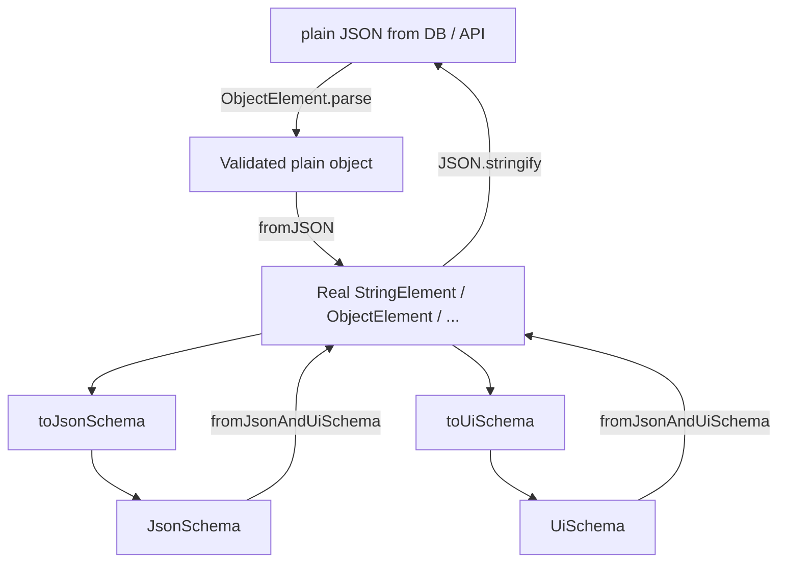

```
//// Example

const raw_json = JSON.parse(dbValue);

// Throws if invalid
const formObject = fromJSON(raw_json);

const json_schema = formObject.toJsonSchema();
const ui_schema = formObject.toUiSchema();

const formObject2 = fromJsonSchemaAndUiSchema(jsonschema, uischema);
// formObject and formObject2 are identical

const json = JSON.stringify(formObject)
```