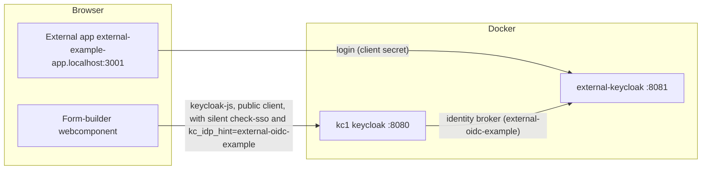

# json-forms-webcomponent-example-external

A minimal Nuxt app that demonstrates how to integrate the form-builder webcomponent into a third-party app with a different OIDc provider than the main app (json-forms-builder). It runs on its **own domain** (`external-example-app.localhost`) so cookie/session isolation between the
apps can be tested in one browser (unlike `localhost` ports, cookies are not shared across different hosts).

For an overview of the concepts before going into details, see [docs/auth/README.md](../../apps/json-forms-builder/docs/auth/README.md#auth-integration-with-external-oidc-provider).

- The app logs in against an **external Keycloak** (`external-keycloak`, service `external-keycloak` in `../json-forms-builder/docker-compose.yaml`) with a **confidential client** (`external-example-app`, client secret).
- After login there is a very basic dashboard ("Hello, \<user\>!") with an input field for the **numeric form id** of the form-builder backend.
- The form renders in the [`<vue-json-form-builder>`](../../packages/vue-json-forms-builder-webcomponent) webcomponent below. The form itself is **not fetched over REST** — it is loaded over the **collab websocket** (Hocuspocus, `ws://localhost:1234`, document name = form id), exactly like in the main builder app. The webcomponent logs in directly against the **main app's Keycloak** (`kc1`, `json-forms-builder` on port 3000) with **keycloak-js** using the PUBLIC client `vueformbuilder-embed` (PKCE): a *silent* `check-sso` runs in a hidden iframe on mount — no navigation, no popup. With `kc_idp_hint=external-oidc-example` the login (only needed when no kc1 session exists) runs straight through the external Keycloak, so the user is authenticated **without any further input**. The kc1 **access token** authenticates the collab websocket (`Authorization: Bearer`, forwarded by the collab server to the backend's `/api/ws-auth` for validation via JWKS).

## Prerequisites

1. Docker services running: `cd ../json-forms-builder && docker compose up -d` (postgres, kc1, external-keycloak). (__Note:__ The federation between kc1 and the external Keycloak is already configured in the imported realm files (`keycloak/dev/dev-realm.json`, `keycloak/external/dev-realm.json`)).
2. The main app running: `cd ../json-forms-builder && yarn dev` (port 3000). Its env must include `NUXT_AUTH_ALLOWED_REDIRECT_ORIGINS=http://external-example-app.localhost:3001` and `NUXT_AUTH_ALLOWED_CLIENT_IDS=vueformbuilder,vueformbuilder-embed` so the kc1 access token of the public embed client is accepted for the collab websocket (already set in its `example.env`).
1. The webcomponent built once (its `dist/` is gitignored): `yarn workspace @educorvi/vue-json-forms-builder-webcomponent build`. TODO: turbo should be able to do this automatically when the repo is integrated successfully.

## Domains

All apps use `.localhost` domains (which browsers resolve to `127.0.0.1` without hosts-file entries):

| App | URL |
| --- | --- |
| Main builder backend | `http://localhost:3000` (kc1, port 8080) |
| This external demo app | `http://external-example-app.localhost:3001` |
| External Keycloak | `http://external-keycloak.localhost:8081` |

__Note:__ Cookies are per-host: this app's session (`external-app-session` on `external-example-app.localhost`), the external Keycloak's SSO cookie and the main backend's session (`nuxt-session` on `localhost`) never collide, even in the same browser.

## What to expect

1. Open **http://external-example-app.localhost:3001** — landing page with a *Login* button.
1. Click *Login* → you are taken to the external Keycloak and logged in (create a test user there first if none exists).
1. You land on the dashboard: *Hello, \<user\>!*
2. Type the **numeric id** of a form of the builder backend into the input field (as shown in the main app's form list) and press Enter. The webcomponent mounts and runs keycloak-js against kc1 (`http://kc1.localhost:8080`, realm `dev`, public client `vueformbuilder-embed`:
   - silent `check-sso` (hidden iframe) → a kc1 session exists → the access token is obtained **without any navigation** and the builder connects straight away.
   - no kc1 session → the builder shows a **Sign in** button; clicking it navigates to kc1, which — thanks to `kc_idp_hint=external-oidc-example` and the existing external SSO session — authenticates the user **without a credential prompt** and redirects back to this page.
   - the silent check-sso iframe is limited in browsers with strict tracking protection (Safari/Firefox): the Sign in button appears even for logged-in users there — the click then does the top-level redirect.
3. The builder connects to the collab websocket (`ws://localhost:1234`, document name = form id) with the kc1 access token as `Authorization: Bearer` (validated by the backend via JWKS, `NUXT_AUTH_ALLOWED_CLIENT_IDS`) and Hocuspocus hydrates the form from its stored definition.
4. Loading another form id re-mounts the builder with the new document.
5. *Logout* clears the local external session (the kc1/external Keycloak sessions stay intact).
