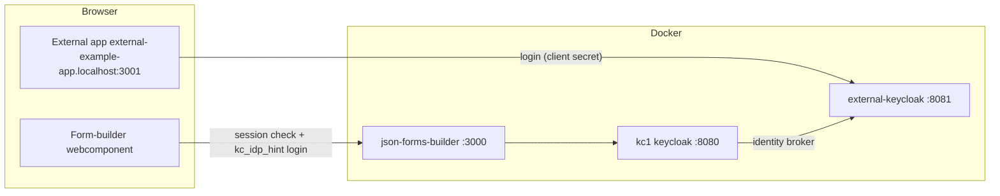

# json-forms-webcomponent-example-external

A minimal Nuxt app that demonstrates how to integrate the form-builder
webcomponent into a third-party app with a **different Keycloak** than the
main app (json-forms-builder). It runs on its **own domain**
(`external-example-app.localhost`) so cookie/session isolation between the
apps can be tested in one browser (unlike `localhost` ports, cookies are
not shared across different hosts).

- The app logs in against an **external Keycloak** (`external-keycloak`,
  service `external-keycloak` in `../json-forms-builder/docker-compose.yaml`)
  with a **confidential client** (`external-example-app`, client secret).
- After login there is a very basic dashboard ("Hello, \<user\>!") with an
  input field for the **numeric form id** of the form-builder backend.
- The form renders in the [`<vue-json-form-builder>`](../../packages/vue-json-forms-builder-webcomponent)
  webcomponent below. The form itself is **not fetched over REST** — it is
  loaded over the **collab websocket** (Hocuspocus, `ws://localhost:1234`,
  document name = form id), exactly like in the main builder app. The
  webcomponent authenticates against the **main app's Keycloak** (`kc1`,
  `json-forms-builder` on port 3000) with
  `kc_idp_hint=external-oidc-example`: its login popup runs through kc1 and,
  thanks to the existing external SSO session, the user is logged in at kc1
  **without any further input**. The popup relays the kc1 **access token**
  back to the webcomponent, which uses it to authenticate the collab
  websocket (`Authorization: Bearer`, forwarded by the collab server to the
  backend's `/api/ws-auth` for validation) — this also works in browsers
  with third-party-cookie blocking, where the session cookie would never
  cross from `localhost` to this app's domain.



## Prerequisites

1. Docker services running: `cd ../json-forms-builder && docker compose up -d`
   (postgres, kc1, external-keycloak). (__Note:__ The federation between kc1
   and the external Keycloak is already configured in the imported realm
   files (`keycloak/dev/dev-realm.json`, `keycloak/external/dev-realm.json`)).
   Keycloak has **no data volume** — realms are re-imported from these files
   on container start, so `docker compose up -d --force-recreate
   external-keycloak keycloak` applies changes from the JSON files.
2. The main app running: `cd ../json-forms-builder && yarn dev` (port 3000).
   Its env must include
   `NUXT_AUTH_ALLOWED_REDIRECT_ORIGINS=http://external-example-app.localhost:3001`
   so the Keycloak callback may redirect back to this app (already set in
   its `example.env`).
3. The webcomponent built once (its `dist/` is gitignored):
   `yarn workspace @educorvi/vue-json-forms-builder-webcomponent build`.
   TODO: turbo should be able to do this automatically when the repo is
   integrated successfully.

## Domains

All apps use `.localhost` domains (which browsers resolve to `127.0.0.1`
without hosts-file entries):

| App | URL |
| --- | --- |
| Main builder backend | `http://localhost:3000` (kc1, port 8080) |
| This external demo app | `http://external-example-app.localhost:3001` |
| External Keycloak | `http://external-keycloak.localhost:8081` |

Cookies are per-host: this app's session (`external-app-session` on
`external-example-app.localhost`), the external Keycloak's SSO cookie and
the main backend's session (`nuxt-session` on `localhost`) never collide,
even in the same browser.

## 1. Create the client in Keycloak (external-keycloak)

The app authenticates against the external Keycloak with a confidential
client. Create it in its admin console:
**http://external-keycloak.localhost:8081/admin** (admin / admin, realm
**dev**) → *Clients* → *Create client*:

| Setting | Value |
| --- | --- |
| Client type | `OpenID Connect` |
| Client ID | `external-example-app` |
| Client authentication | **ON** (confidential, uses a client secret) |
| Standard flow | ON |
| Valid redirect URIs | `http://external-example-app.localhost:3001/auth/keycloak` |
| Valid post logout redirect URIs | `http://external-example-app.localhost:3001/*` |
| Web origins | `http://external-example-app.localhost:3001` (or `+` for all) |

After saving, open the *Credentials* tab and copy the **Client secret** into
`.env` (see below).

> If you prefer JSON over the UI: the exported realm entry looks like this
> (adapt `secret` to the generated value):
>
> ```json
> {
>     "clientId": "external-example-app",
>     "clientAuthenticatorType": "client-secret",
>     "secret": "<generated-secret>",
>     "redirectUris": ["http://external-example-app.localhost:3001/auth/keycloak"],
>     "webOrigins": ["http://external-example-app.localhost:3001"],
>     "bearerOnly": false,
>     "standardFlowEnabled": true,
>     "implicitFlowEnabled": false,
>     "directAccessGrantsEnabled": false,
>     "serviceAccountsEnabled": false,
>     "publicClient": false,
>     "frontchannelLogout": true,
>     "protocol": "openid-connect",
>     "fullScopeAllowed": true,
>     "defaultClientScopes": ["web-origins", "acr", "profile", "roles", "basic", "email"],
>     "optionalClientScopes": ["address", "phone", "offline_access", "organization", "microprofile-jwt"]
> }
> ```

## 2. Configure the environment

```sh
cp example.env .env
```

Then paste the client secret into `NUXT_OAUTH_KEYCLOAK_CLIENT_SECRET` in
`.env`. The other variables are pre-filled for the local docker setup:

| Variable | Meaning |
| --- | --- |
| `NUXT_OAUTH_KEYCLOAK_CLIENT_ID` | `external-example-app` — Client ID created above |
| `NUXT_OAUTH_KEYCLOAK_CLIENT_SECRET` | Client secret from the external Keycloak admin console |
| `NUXT_OAUTH_KEYCLOAK_SERVER_URL` | `http://external-keycloak.localhost:8081` |
| `NUXT_OAUTH_KEYCLOAK_REALM` | `dev` |
| `NUXT_PUBLIC_BACKEND_URL` | `http://localhost:3000` — the backend (json-forms-builder) the webcomponent authenticates against |
| `NUXT_PUBLIC_KEYCLOAK_IDP_HINT` | `external-oidc-example` — IdP alias in kc1 that redirects to the external Keycloak |
| `NUXT_PUBLIC_COLLAB_URL` | `ws://localhost:1234` — Hocuspocus collab server of the backend (run `yarn dev:collab` there); the builder loads the form over this websocket |
| `NUXT_SESSION_PASSWORD` | Any random string, used to encrypt the session cookie |
| `NUXT_SESSION_NAME` | `external-app-session` — session cookie name. This app is on its own domain, so it cannot collide with the backend's `nuxt-session` cookie anymore; the distinct name is kept as good practice. |

## 3. Export the realm

The external Keycloak has **no data volume** — everything is imported from
`../json-forms-builder/keycloak/external/dev-realm.json` on container
start. After creating the client, export the realm so the change is
reproducible:

```sh
cd ../json-forms-builder
./export-realm.sh external-keycloak
# -> writes keycloak/external/dev-realm.json
```

From now on, `docker compose up -d --force-recreate external-keycloak`
re-imports the realm with the client included.

## 4. Run

```sh
yarn install
yarn dev        # http://external-example-app.localhost:3001
```

## What to expect

1. Open **http://external-example-app.localhost:3001** — landing page with
   a *Login* button.
2. Click *Login* → you are taken to the external Keycloak and logged in
   (create a test user there first if none exists).
3. You land on the dashboard: *Hello, \<user\>!*
4. Type the **numeric id** of a form of the builder backend into the input
   field (as shown in the main app's form list) and press Enter. The
   webcomponent mounts and checks the session on `http://localhost:3000`
   (json-forms-builder / kc1):
   - not logged in → a small **popup** opens
     `/auth/keycloak?kc_idp_hint=external-oidc-example&redirect=/auth/popup-close`;
     kc1 forwards the hint to the external Keycloak, whose SSO session
     authenticates the user automatically — **no credential prompt**. The
     popup signals the opener and closes itself; the page (and the form id
     you typed) is untouched.
   - logged in → straight on, no popup.
   - popup blocked → the builder shows an inline **Sign in** button;
     clicking it opens the popup within the user gesture (never blocked).
     The page is never redirected.
5. The builder connects to the collab websocket (`ws://localhost:1234`,
   document name = form id, handshake carries the kc1 session cookie) and
   Hocuspocus hydrates the form from its stored definition.
6. Loading another form id re-mounts the builder with the new document.
7. *Logout* clears the local external session (the kc1/external Keycloak
   sessions stay intact).

> The form must have been saved once in the new builder (it needs a
> `definition` in the backend — forms that only have a legacy `{json, ui}`
> schema open as empty documents, same as in the main app).

> **Cross-site note:** because this app runs on a different domain than the
> backend, the webcomponent's session check and the collab websocket
> handshake are cross-site requests. The backend therefore sets its session
> cookie with `SameSite=None; Secure` (see `runtimeConfig.session` in
> `../json-forms-builder/nuxt.config.ts`). Browsers accept the `Secure`
> attribute on `localhost` even over plain HTTP.
