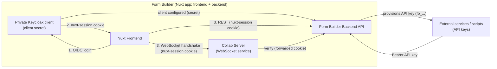
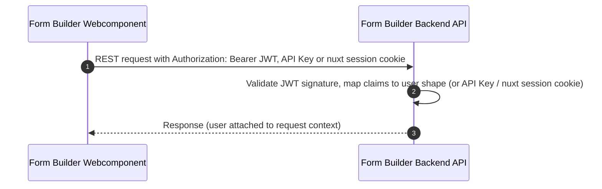
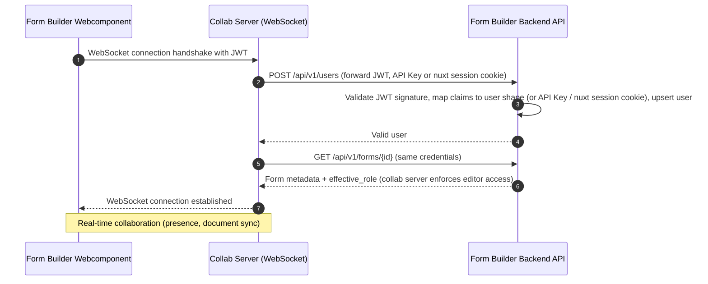
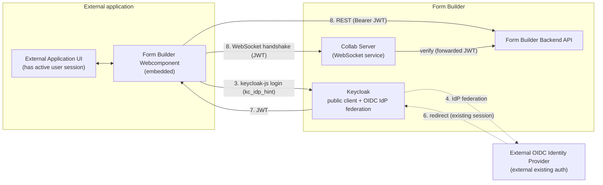
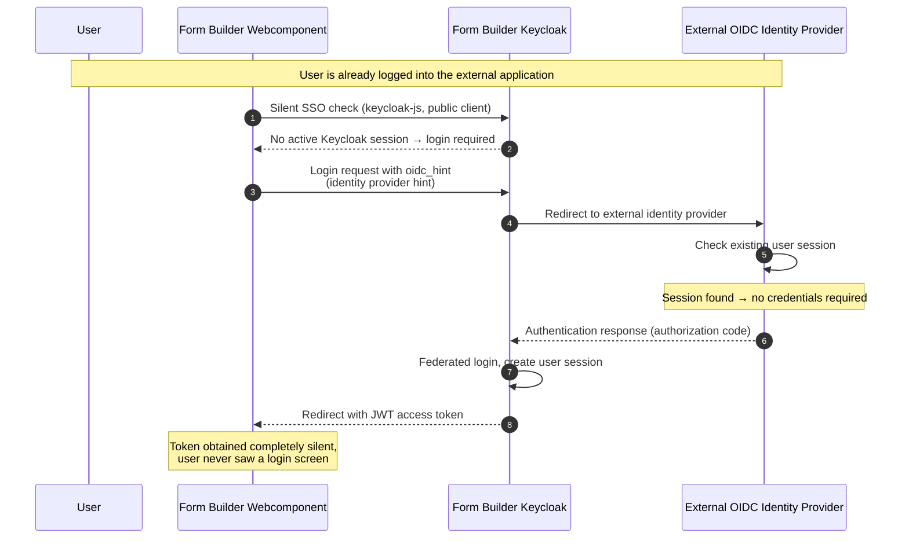

# Authentication

The application supports three ways to authenticate a request. The global auth middleware (`server/middleware/auth.ts`) resolves them in this order and attaches the user to `event.context.user`; protected oRPC procedures throw `UNAUTHORIZED` when no user was resolved. The same middleware also protects the routes the collab server (separate process) calls to validate WebSocket handshakes: `POST /api/v1/users` (authenticates and upserts the user) and `GET /api/v1/forms/{id}` (checks form existence and access, returns the caller's `effective_role`, which the collab server uses to enforce editor access).

## Keycloak clients

Two Keycloak clients are used, both in the same realm:

- **Nuxt client** `vueformbuilder` (private, with client secret, configured via `NUXT_OAUTH_KEYCLOAK_CLIENT_ID`) — used by the form builder Nuxt frontend itself for the session-cookie login (method 1 below).
- **Embed client** `vueformbuilder-embed` (public, no client secret, PKCE S256) — used by the form builder webcomponent embedded on other domains via keycloak-js (method 3 below). A client secret cannot be stored securely inside a webcomponent, so this client must be public.

The Form Builder Backend API accepts access tokens from **both** clients: session-cookie logins produce tokens of the private Nuxt client, while the webcomponent's bearer tokens come from the public embed client. Which clients are accepted for bearer tokens is configured via `NUXT_AUTH_ALLOWED_CLIENT_IDS` (see the allow-list in `server/lib/jwt-auth.ts`).

## 1. Session cookie (OIDC login)

Used by the form builder Nuxt frontend. Handled by the [nuxt-auth](https://github.com/nuxt-community/auth-module) module against the private Nuxt client (`vueformbuilder`). On success a nuxt-auth-utils session is created and the browser gets the `nuxt-session` cookie. Requests carrying the cookie resolve the session via `getUserSession()`. See [server/routes/auth/keycloak.get.ts](../../server/routes/auth/keycloak.get.ts) for implementation details.

## 2. API keys (`fb_...`)

Static keys provisioned by the Form Builder backend via the app's API-key management. Sent as `Authorization: Bearer fb_...`; validated against the database by `ApiKeyService` (SHA-256 hash). Can be used by external services, user scripts or backends to access the API without a user session. See [server/services/ApiKeyService.ts](../../server/services/ApiKeyService.ts) for implementation details.

## 3. Keycloak access tokens (JWT)

The webcomponent embedded on **other domains** cannot rely on the session cookie. Instead keycloak-js is used to authenticate against the public embed client (`vueformbuilder-embed`). The collab server forwards the token for the websocket handshake exactly like an API key. `server/lib/jwt-auth.ts` validates signature (realm JWKS, cached), `iss`, `aud` and `exp` with `jose` and maps the claims to the same user shape as the session user. See [server/lib/jwt-auth.ts](../../server/lib/jwt-auth.ts) for implementation details in the backend as well as [composables/useBuilderAuth.ts](../../../packages/vue-json-forms-builder/src/composables/useBuilderAuth.ts) for the frontend authentication code using keycloak-js.

The webcomponent also supports silent SSO (Single Sign-On) using keycloak-js. In combination with an authentication federation with the OIDC provider the integrating app already uses and an `oidc_hint` that Keycloak supports, this leads to a silent login process for the user since they are automatically authenticated if they have an active session with the identity provider. An example application exists in [apps/vue-json-forms-builder-external-example](../../../apps/vue-json-forms-builder-external-example) that demonstrates this behavior and explains more details.

## General authentication flow

#### Internal authentication flow (Nuxt app & API keys)

The webcomponent/public-client/external-IdP flow above only applies to embeds on other domains. The form builder's own Nuxt frontend never leaves our domain, so it uses the **private** Keycloak client instead and never touches an external identity provider or API keys directly:

#### Rest API call with JWT token

Independent of the authentication method, the backend always resolves a user and attaches it to the request context. The Websocket service forwards the authentication information to the backend for validation. The following sequence diagram shows how a REST API call with a JWT token is handled and how the user is attached to the request context.

#### Rest API call with JWT token sequence (user attached to request context)

### Auth Integration with external OIDC provider

The Form Builder Frontend Webcomponent can be integrated within other applications and still needs to communicate with the form builder backend and the Websocket Service. When the external already uses an OIDC compatible authentication system, a integration within the existing form builder authentication is possible. First of all, we need to use `JWT authentication`. (The session cookie (1) is managed by nuxt and therefore not useable within the webcomponent. The api key (2) could be used but users form the external service would first need to be created and api keys would need to be managed by the external backend integrating the web component. So the easiest way is using `JWTs` which are provided by a client within the keycloak of our application.) In comparison to the client from the form builder nuxt application, which is a private client with a client secret, the webcomponent depends on a public client since a client secret can't be stored securely within the webcomponent.

The next step is to link the oidc from the external application to the webcomponent and the keycloak of the form builder backend. Keycloak allows login through other OIDC compatible identity providers. The external applications OIDC Provider needs to be configured as an identity provider within the keycloak of the form builder backend. This makes it possible for users of the external application to login within the form builder backend and receive a JWT token form the form builder keycloak which can be used for authentication within the webcomponent. Both backends don't need to do any extra work for user management. 

When leaving the authentication process like this, a user signing in from the webcomponent would first be presented with the keycloak login screen of the form builder keycloak and sees a button to login with the custom oidc method below the login form. The user would need to manually click on the external provider button, but luckily the process can be made much more seamless for the user. Keycloak provides a feature called `identity provider hint` which can be used to automatically redirect the user to the external identity provider. The webcomponent can be configured to use this feature by providing the `oidc_hint` parameter (see [docs](https://www.keycloak.org/docs/latest/server_admin/index.html#_client_suggested_idp)) within the login request.

Since the external identity provider is the one being used by the external application integrating the webcomponent, the user is already logged in and has a valid session. This means that the user doesn't need to provide any credentials and is automatically logged in. Keycloak additionally provides a `silent SSO` (see [here](https://www.keycloak.org/securing-apps/javascript-adapter#_using_the_adapter)) feature which can be used to automatically get the JWT token without any user interaction. So no new tab opens and the user stays on the same page while the login happens silently within an invisible iframe. This makes it possible to get a token for the webcomponent completely silent without any user interaction or interruption at all.

Looking at the complete login flow, the webcomponent is loaded and wants a JWT from the form builder keycloak.
0. The user is already logged in within the external application and has a valid session with the external identity provider.
1. The webcomponent embedded in the external application checks if a valid JWT is already available for the public embed client in the form builder Keycloak
2. If a valid JWT is not available, the check is forwarded to the webcomponent's keycloak-js adapter
3. The webcomponent redirects to the form builder Keycloak and provides the `oidc_hint` parameter.
4. Since the `oidc_hint` parameter is provided, the form builder Keycloak redirects the user to the external identity provider for authentication.
5. Since the user is already logged in within the external application, the external identity provider automatically authenticates the user
6. The external identity provider redirects the user back to the form builder Keycloak with an authentication response.
7. The form builder Keycloak validates the authentication response, creates a user session and issues a JWT token for the webcomponent.
8. The webcomponent receives the JWT token and can now authenticate with the form builder backend.

#### Overview of the authentication flow

The step numbers match the [numbered flow above](#auth-integration-with-external-oidc-provider); steps 0, 1, 2 and 5 happen inside the webcomponent/IdP and aren't drawn as edges here.

#### Silent SSO login sequence (no user interaction required)

A demo application exists within [apps/vue-json-forms-builder-external-example](../../../apps/vue-json-forms-builder-external-example) which goes into more detail on what needs to be configured and how the integration works. This uses a separate nuxt application and two local keycloak instances to showcase how they work together in a simple local demo application.

# Permissions

A role based access control (RBAC) system is implemented in the backend. In the code the business logic for defining the roles and the classes containing all relevant permissions and capabilities of a role are defined [here](../../server/lib/permissions). They are also reused in the frontend in order to show specific actions only to specific users. The backend validates these rules on API calls and the frontend only uses this logic for displaying the correct actions to the user. The backend is the single source of truth for permissions and capabilities.

# Security

All API endpoints are secured by the same auth middleware. There exists one public API endpoint which doesn't require authentication (`/status`). Since no other public endpoints exist, this strongly reduces the risk of unauthenticated users being able to access data. The ways to authenticate were described above and are implemented within [the auth middleware](../../server/middleware/auth.ts). The auth code also includes logic from the [JWT validation](../../server/lib/jwt-auth.ts) and the [API key service](../../server/services/ApiKeyService.ts) and also less critical code like the [user mapper functions](../../server/lib/auth.ts). This code is critical as it is the guard for all actions to read and modify data.

A security test [auth-required](../../tests/integration/tests/permissions/auth-required.integration.test.ts) exists which tests that all endpoints are protected and require authentication if not explicitly excluded within the test suite. This mitigates the risk of accidentally exposing endpoints to unauthenticated users.

In order to securely sync the current Keycloak roles and profile properties for users to the backend, a Nuxt plugin [session](../../server/plugins/session.ts) exists which hooks into every session fetch and validates on the server side that the user is available in the database and if roles in Keycloak changed, they are reflected properly.

The standalone Vue form builder and webcomponent talk with the HocusPocus collaboration server over a WebSocket connection. The collab server is a separate process and is secured in the same way as the backend. The components have to either set a session token, a JWT or an API key and the collab server forwards this to the backend for validation. It first creates the user with the `POST /api/v1/users` endpoint so we are sure the correct user information of the token is reflected in the backend and then calls `GET /api/v1/forms/{id}` to validate the effective user role for this resource. This ensures that only users with the correct role can edit a form and the logic for calculating the roles is done centrally in the backend.

Role based access control (RBAC) is also implemented in the backend at a central place within [permissions](../../server/lib/permissions). This is reused in the frontend so only actions a user can do are displayed in the frontend, but these rules are always validated on every request on the server side.

The RBAC system involves quite a bit of code as permissions can be inherited and overridden but only by more specific roles. Only specific users with specific roles can do certain actions. Admins can always do all actions. Additionally visible resources exist where users don't need explicit permission to have read-only access. In order to properly test the RBAC system, integration tests exist which extensively test these rules and can be found within the [permissions tests directory](../../tests/integration/tests/permissions).
