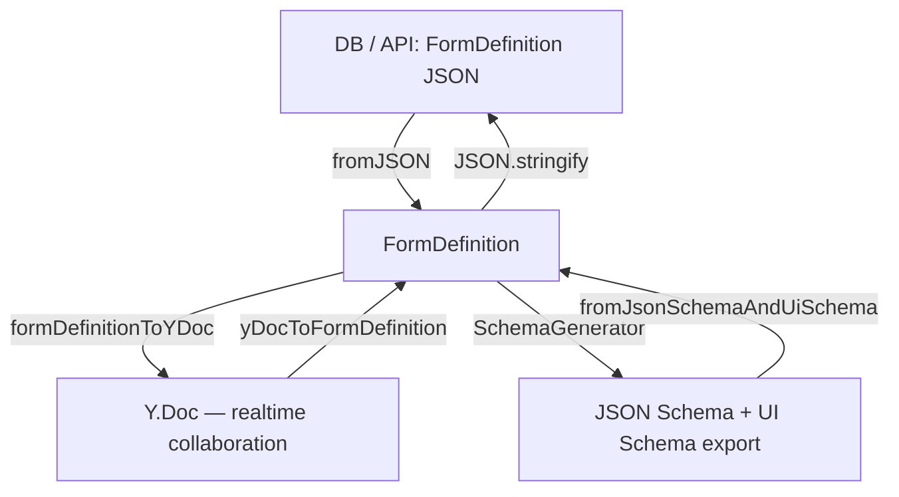

# @educorvi/vue-json-forms-builder-schemas

Form element model for the Vue JSON Form Builder. Defines the element hierarchy
that powers the builder UI **and** the backend, generates standard JSON Schema
+ UI Schema for export, and ships a **Yjs adapter** for realtime collaboration.

```
packages/vue.json-form-builder-schemas/schemas/
├── index.ts              package entry (re-exports everything incl. collab)
├── utils.ts              createId, Layout enum, base JSON schema helpers
├── registry.ts           FormElementRegistry: type → element class
├── reconstruct.ts        fromJSON() / fromJsonSchemaAndUiSchema()
├── FormEntityEnums.ts    UI enums (formats, variants, …)
├── elements/
│   ├── base.ts           Entity (uid/id + data, zod-validated)
│   ├── form-element.ts   FormElement → BaseDataElement → SimpleElement
│   ├── container.ts      ContainerElement → ArrayElement / ObjectElement
│   ├── string.ts         StringElement (StringFormat)
│   ├── number.ts         NumberElement (integer / number)
│   ├── html.ts           HTMLElement
│   ├── dependency.ts     Dependency / DependencyGroup (AND/OR)
│   ├── form.ts           Form (root of the tree)
│   ├── form-definition.ts FormDefinition — uid-indexed tree (O(1) lookups)
│   └── schema-generator.ts SchemaGenerator — tree → {json, ui} export
└── collab/               Yjs adapter (separate entry "./collab")
    ├── yjs-adapter.ts    FormDefinition ↔ Y.Doc, CRDT-safe mutations
    └── awareness.ts      presence: online users, selection, editing, cursor
```

## The model in one picture



* Every node (Form, element, dependency group) is an `Entity` with a globally
  unique `uid` and a human-readable `id`. All state lives in `data`, validated
  against the class' zod `schema` — so `data` is the serialization contract.
* A `FormDefinition` wraps a `Form` root and indexes every element by `uid`
  (`nodesIndex`), remembers parents (`parentIndex`) and dependencies
  (`dependencyGraph`). Containers reference children by `uid` arrays, which is
  exactly what makes the tree Yjs-friendly.
* JSON Schema + UI Schema are **derived** from the tree via `SchemaGenerator` —
  there is no separate schema state that could diverge while collaborating.

## Usage

```ts
import {
    fromJSON,
    fromJsonSchemaAndUiSchema,
    SchemaGenerator,
    StringElement,
    ArrayElement,
} from '@educorvi/vue-json-forms-builder-schemas';

// Load a persisted form
const form = fromJSON(savedJson);

// Mutate the tree (uid-based)
form.insertElement(new StringElement({ title: 'Email' }), form.root, 0);

// Export standard JSON Schema + UI Schema
const generator = new SchemaGenerator(form);
const jsonSchema = form.root.toJsonSchema(generator, ['properties']);
const uiSchema = form.root.toUiSchema(generator);

// Import from a {json, ui} pair (existing DB format)
const form2 = fromJsonSchemaAndUiSchema(jsonSchema, uiSchema);
```

## Realtime collaboration (Yjs)

The `collab` entry maps the form tree to a Y.Doc:

* `doc.getMap("root")` — the Form's data (its `children` is a `Y.Array<uid>`)
* `doc.getMap("elements")` — `Y.Map<uid, Y.Map<data>>`, one map per element;
  container `children` entries are `Y.Array<uid>` so concurrent
  add/move/remove merges conflict-free at the exact position.

```ts
import * as Y from 'yjs';
import {
    formDefinitionToYDoc,
    yDocToFormDefinition,
    addElement,
    updateElementField,
} from '@educorvi/vue-json-forms-builder-schemas/collab';

// Client A opens the form: hydrate a Y.Doc from the persisted FormDefinition
const doc = formDefinitionToYDoc(persistedForm);

// All subsequent mutations go through the document (one Yjs transaction each)
addElement(doc, doc.getMap('root').get('uid'), new StringElement({ title: 'Email' }));
updateElementField(doc, someElementUid, 'title', 'Full name');

// Send/receive binary updates via y-websocket / Hocuspocus:
//   wsProvider = new WebsocketProvider(url, `forms/${formId}`, doc, { connect: true })
//   wsProvider.on('sync', ...) / doc.on('update', ...)
// To persist: Y.applyUpdate(doc, latestState) → yDocToFormDefinition(doc) →
// debounce → store via your existing REST endpoint.
```

### Presence (who is here, what are they doing)

Awareness is ephemeral state broadcast to everyone in the form's room — online
users, selected elements, the field being edited, canvas cursor:

```ts
import {
    setPresenceUser,
    setSelectedElement,
    setEditingField,
    setCursor,
    getRemotePresenceStates,
} from '@educorvi/vue-json-forms-builder-schemas/collab';

setPresenceUser(wsProvider.awareness, { id: 'u-42', name: 'Alice', color: '#0f6' });
setSelectedElement(wsProvider.awareness, elementUid);   // tree/canvas selection
setEditingField(wsProvider.awareness, elementUid, 'title'); // right panel focus
setCursor(wsProvider.awareness, { x: 120, y: 340 });    // remote cursor
```

### Which forms are being worked on?

That is **not** Yjs' job — track it server-side. The websocket server knows
which rooms are open and who is connected (`onConnect`/`onDisconnect` hooks,
Hocuspocus). Write the join/leave events to a small `form_session` table and
expose them through the oRPC API (e.g. `active_editors` on the forms list or a
`GET /rpc/forms/{id}/active-sessions` endpoint).

## Development

```bash
yarn workspace @educorvi/vue-json-forms-builder-schemas build   # turbo: build:internal + check-types
yarn workspace @educorvi/vue-json-forms-builder-schemas test:unit
```

Tests: `tests/form-definition.test.ts` (roundtrip, tree operations, schema
generation, import) and `tests/yjs-adapter.test.ts` (Y.Doc roundtrip, CRDT
convergence of two concurrent clients, awareness helpers).

## Status / TODOs

* `DependencyGroup.toJsonSchema/toUiSchema` are stubs (dependency → rule
  generation not implemented yet).
* `fromJsonSchemaAndUiSchema` restores the element tree from `{json, ui}` but
  flattens layout nesting and does not restore wizard pages / `showOn` yet.
* Wizard pages, button groups and other future element types plug in via
  `FormElementRegistry` (type string → class).
